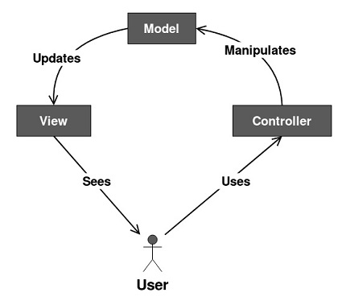

## **Knowing The Drink Before Pouring Milk**

Over the course of going through the ICS 314 Software Engineering course at the University of Hawaii at Manoa, I have been "blindly" writing code and building small applications without really giving a second thought as to how the code even came about in the first place. This went on until recently, when we learned about design patterns. For starters, design patterns are like the ingredients or different drinks of coffee that give a sense of direction as to how one would like their coffee. Back to the coding world, design patterns are the broad top-level guidelines for software engineers to follow before they start building an application. Usually when you break down a problem, you will always try to break it down into the smallest parts possible. You can think of design patterns as the first level of breaking down a problem. Once you have figured out the appropriate design pattern for your project like the Model-view-controller (MVC) design pattern, then you can start building out your project or analagous to making coffee, you can start pouring the milk and make yourself a tasty hot latte.

There are quite a few varieties of design patterns like the Factory, Singleton, Observer, and Model-view-controller, just to name a few. Instead of getting bogged down by all the details for all of the design patterns I have listed, I will give a general overview of the Model-view-controller (MVC) design pattern. The MVC design pattern has three parts (not including the user) to it, the model, the view, and the controller. The **model** gets changed or manipulated by the controller. The **view** is the only visual part of the application that the user sees. Then, the **controller** is the part of the application that the user can use to manipulate the model. Putting this together, the user sees the **view** which would also present the **controller** to the user. The user can then use the **controller** to manipulate the **model** which could be the database, front-end data or front-end visuals. Once the **model** is manipulated, the **view** is then updated with the new model and presents the new view to the user. Below is a diagram to better visualize this explanation.

---

---

## The Design Pattern That I Commonly Use

Subjectively speaking, I think that the design pattern I have been commonly using in my own code is the Model-view-controller design pattern. This is because most, if not all, of the projects I have built had to deal with a user being presented with a view, having a controller to manipulate data, and manipulating a model from using the controller. For example, a [food chat bot that I created during the late-spring and early-summer of 2020](https://jackiewong99.github.io/grub-bot/) used the MVC design pattern. Moreover, the user is presented with the view, which is the overall user interface and chat bot. Then within the view, the user is given the controller which are a selection of buttons that a user can click. When a user clicks on a button, the model (front-end interface) is manipulated in the background, and the view is updated with the succeeding chat bot prompts. The other part of the project that used the MVC design pattern is when the chat bot finds a random restaurant and presents the data to the user. To explain, when the user has gone through all of the chat bot prompts (used the controller), the front-end then goes through the process of being manipulated (fetching data and presenting new data), and finally the view gets updated with the newly fetched data from the model. Looking back at when I was building this project, I did not have an active and conscious thought about what design pattern I was using. Until I was made aware of these design patterns in my current software engineering course, did I then realize that I was in fact following a design pattern all this time.

Once again with the coffee, after learning about design patterns, I realized that not only can this idea apply to code but this can also be applied generally to nearly any process of my daily life. Whenever I buy or make my own coffee, the MVC design pattern is essentially being followed. The model is the espresso shot, the view is the color and taste of the current state of the drink, and the controller is the milk. More on this, let's say maybe I want to drink a latte. I would then take my controller which is the steamed milk, and start pouring or manipulating my model which is the espresso shot. The model then goes through the process of updating, which would be the mixture of all that chemical goodness going on in the coffee. Finally, the view which is the color and taste of the coffee is updated to a hot latte. Where am I going with this analogy? I am showing that for anyone who learns about design patterns for the first time, relating it back to any of their daily life activities is an effective way of learning design patterns. Even though at a glance, design patterns seem obvious and trivial, they can become complex, thus the emphasis on using an analogy to help reinforce that knowledge. In the end, design patterns help you think again about what exactly your project is doing, give you a sense of direction as to how to structure the building process, and allow you to enjoy a delightful hot latte.
