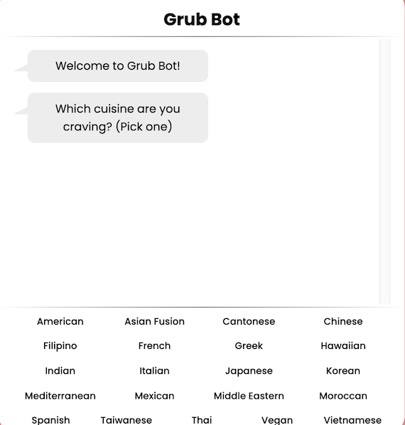

Grub Bot was inspired by a Capital One coding challenge. The challenge was to eliminate the indecisive part of finding a place to eat when searching the web. To summarize, the requirements of the original challenge were to make a chat bot that narrows the selection of restaurants, fetches data from the [Yelp Fusion API](https://www.yelp.com/fusion), plots restaurants on a map, and utilizes the [Geolocation API](https://developer.mozilla.org/en-US/docs/Web/API/Geolocation_API). Originally, this project was intended to be collaborative with 2 other friends, however after some time, I had a desire to learn everything that had to do with this project since there were many parts of it that were new to me. After this thought, I parted ways and went off to build Grub Bot on my own.

I decided to only create the main features of what the coding challenge prompts and to iterate on this project in the future, leading to a complete version of my take on the coding challenge. This is because the original challenge was beyond the scope of my skills hence why I did not partake in it and made the statement that this project was inspired by a Capital One coding challenge.

This project is quite important as this was the project where I gained much more experience with vanilla JavaScript. I personally felt that instead of jumping straight into a framework like I did with React in my first project, that I should create a project with vanilla JavaScript to gain a better understanding of how these frameworks work under the hood and how the event loop works in JavaScript. The next thing I learned in this project is creating my own proxy server. In order to conform with the Cross-origin resource sharing (CORS) policy to fetch data from the Yelp Fusion API, I needed to create a proxy server to communicate with Yelp's server, and so I programmed it with [Node.js](https://nodejs.org/en/) and [Express.js](https://expressjs.com/) and hosted the server on [Google Cloud Platform](https://cloud.google.com/).

The other web tool I learned was Geolocation API, which to my surprise was much simpler to implement than I had originally imagined. With just a few lines of code, I was able to retrieve the user's current location.

Then, to spice things up a little more, I decided to use SCSS (Sass Cascading Style Sheets) as the styling language. This is because, after I read through the [Sass](https://sass-lang.com/) documentation, I became really interested in making use of the modularity of SCSS. However, I am not a fan of the extra setup steps for styling preprocessors. Aside from that, I really like the modularity, efficiency, and cleanliness of code that you can get from using SCSS.

The current features are: chat bot, retrieve user's location, and fetch data from the Yelp Fusion API.

You can check out the project's repository [here](https://github.com/jackiewong99/grub-bot).
