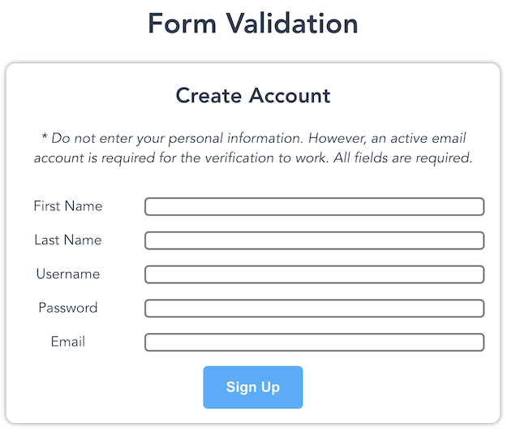

  

Form Validation is a project that I created by myself. I decided to take on this project because after researching some common tasks in web development, I found that validating form data is a common occurrence in web development. As I am not exactly well versed in what the industry standard is with validating form data other than emails, I figured that one way to approaching this project is to learn [regular expressions](https://developer.mozilla.org/en-US/docs/Web/JavaScript/Guide/Regular_Expressions) (RegEx) and validate form data through character patterns. As for contribution to this project, like I said in the beginning, this was a completely solo project that I wanted to take on out of my own interest. I suppose you could say I was the project manager, lead programmer, lead designer, and lead this and that.

In this project, there were quite a few new experiences. As I felt that I had a good amount of experience with vanilla JavaScript, I decided that this would be a good opportunity for me to learn [Vue.js](https://vue.js.org/), a framework I have been wanting to learn for a long time and that is quickly rising in popularity. Expanding on that, I learned the component system that Vue.js uses and how this framework really does take the good parts of Angular and React and turn it into this nice framework. I then learned how to write basic regular expressions for validating a user's first name, last name, and password. Finally, for validating a user's email, I used [Firebase](https://firebase.google.com/) to create a user in a database and then sending a verification email to verify that the user's email is valid. Before using Firebase, I thought I could use regular expressions to validate the character pattern of emails. However, after researching about validating emails with regular expressions, I learned that it is impossible and inefficient to create a regular expression that validates the many patterns of email addresses. That is when I brainstormed other ways of validating emails and came to the realizations that many web app forms use verification emails to validate an email address and that is how I decided to implement Firebase to the project since their SDK is quick to use and their documentation is well written.

You can check out the project's repository [here](https://github.com/jackiewong99/form-validation).
