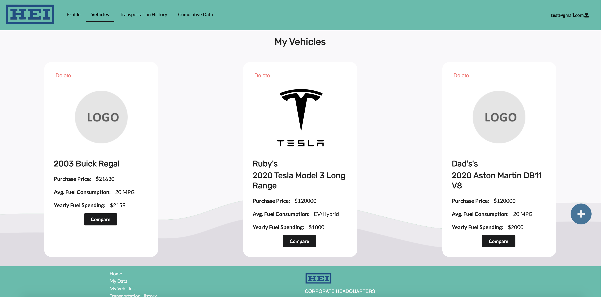
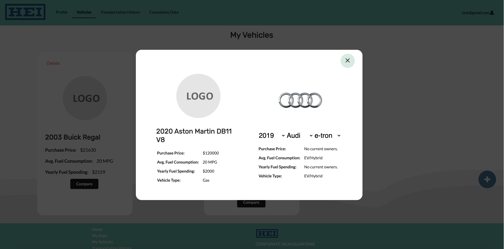
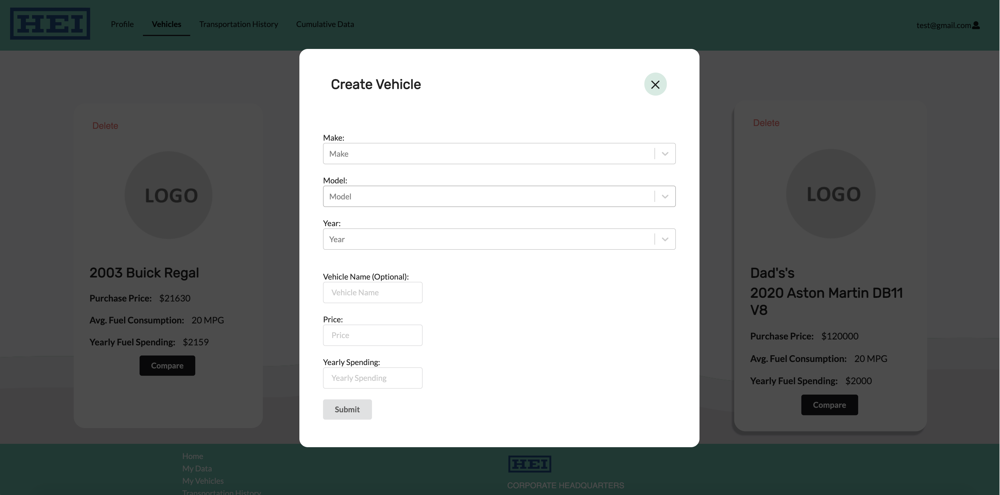

## **Leveling Up in the Software Engineering Path**

During this past Spring 2021 semester at the University of Hawaii at Manoa, eight other classmates and I have developed one large project over the course of the entire semester. We (all other groups of the class as well) were assigned to build a web application project for Hawaiian Electric Industries (HEI) that would track the amount of greenhouse gases emitted by transportation on a daily basis. My group named our project the _GHG-Tracker_, short for _Greenhouse Gases Tracker_. The goal of this project is to impact our community towards a zero emissions lifestyle and to educate them about the positive impacts of alternative modes of transportation. Initially, coming into this course, I was only expecting to build a project for the sake of building experience in software engineering and submitting a finished product only to the instructor. Turns out I was wrong and the project for this course was a bigger deal than I expected. During this course, a few of the aspects that stood out to me were teamwork, impact, and project management.

Firstly, the teamwork in my group during this semester was the greatest I have ever experienced so far in any group project. I think part of this is from the fact that this is a 400 level ICS course and the second level of the _Software Engineering_ curriculum which one can assume that students will take matters more seriously here. I had a lot of enjoyment working with my teammates as everyone had good communication skills, knew how to work together, and discuss any problems maturely. Part of this may also be due to the fact that all the students in this course built more skills compared to when they first experienced web application development in _Software Engineering I (ICS 314)_. I felt that in the first level software engineering course, everyone was focused on making sure they knew how web development worked rather than putting more focus on the team aspect and working together to get tasks done. Then in this second level software engineering course, all the students' skills were more refined and we were more focused on completing the tasks at hand rather than feeling lost about web development. Part of the great teamwork also came from the level of seriousness when we were informed of the impact of this project.

Secondly, I was a bit surprised when we were informed that this project was to be built for a real client and will potentially have an impact on our immediate communities. Throughout my academic career, I was always used to working on dead-end assignments and projects. By dead-end, I mean that the assignments and projects only went to one place, and that was the instructor. To be informed that I will be working on a project that can have a real impact on our community made me excited to work on the project. During this project, my team would have meetings twice a week. For each meeting, especially during the middle of the project, I would find it amusing that the ideas we discuss in meetings were all about making a real impact on the community such as making the user feel proud and rewarded for switching towards a more green lifestyle. Usually, students would be assigned projects that are to be completed with the course's material written all over it. However, in this case, we were creating a solution not only for a client but also for our community. Throughout each day of working on this project, I would pause at times and think to myself, "Wow, someone will most likely be educated and impacted from this part of the project I'm working on." From teamwork to impact, the process of our project management was seamless.

Finally, the style of _Agile Project Management_ that all of our groups used this semester is _Issue Driven Project Management_. Once again referring to the _Software Engineering I_ course in the previous semester, going through the Issue Driven Project Management style was a bumpy road and ended up with many inconsistencies. Then coming into this course (_Software Engineering II_), the implementation of Issue Driven Project Management was much more consistent and smooth. My group members and I all had a better grasp at creating issues or tasks that would take two to three days to complete. Everyone in my group was also very familiar with how the auto kanban project board on _GitHub_ worked. The entire process of managing tasks for this semester's project went smoothly and consistently for my group. Extending on project management, when it came to our meetings' discussions for tasks, we all knew where our areas of best skills were. Based on areas of best skills, my group also distributed tasks based on that principle, this resulted in an organized distribution and higher quality completion of these tasks.

In the end, the teamwork, impact, and project management in my group for this semester was an extremely positive experience to remember. Usually group projects have a mixed bag of members, where most of the time, there is an even distribution of the serious and not-so-serious group members. In this past semester, this was not the case. All of my group members were great to work with and I felt as though we had a good synergy of getting work done. As the title suggests, I feel that I have "leveled up" in my software engineering path, and I think if not all, that most of my group members feel the same after having "completed" this group project experience (a software project is never complete).

## **What I Worked On**

During this project, I mostly worked on the "My Vehicles" page (image shown above) of the GHG-Tracker web application. I also designed the backdrop wave design. I was not able to spend 100% of my time on this project since I had obligations for my other classes, however I still tried to create a modern looking user interface and experience for the user's vehicles page. For most of the animations and effects, I used a React animation library called [Framer Motion](https://www.framer.com/motion/), this made manipulating React components and the virtual DOM tree to be stress free. By using _Framer Motion_, I did not have to worry about causing problems with React's virtual DOM tree. Part of creating a great UI/UX is minimizing the amount of clicks the user has to make. In the other group's web app, they created a separate page for comparing ICE (internal combustion engine) vehicles to electric/hybrid vehicles. While that does make sense and is a fusible design choice, I felt that it was unnecessary to have the user make a few more clicks to compare vehicles and that creating a separate page took away from the purpose of comparing vehicles. The same thing happened with the "add vehicle" feature, the other groups made a separate page to add a vehicle which I also felt was unnecessary.

From the images above, I also designed and created the vehicle comparator and "add vehicle" modal. I decided that a good UI/UX choice was to place all the vehicle related features into one area of the web app, which is the "My Vehicles" page. I made the vehicle comparator compare the user's vehicle because I concluded that the purpose of comparing vehicles is to educate the users about zero-emission vehicles and there is far greater impact when they are comparing their own vehicles. Also, rather than having to make a few more clicks to navigate to a separate page only to compare vehicles, the user only has to make one more click to compare their own.

Then I applied the same principle for the "add vehicle" feature. Rather than routing the user to a separate page to add a vehicle, I thought that it would be more intuitive and practical to place the "add vehicle" feature in the same page of the "My Vehicles" page. Since the "add vehicle" form does not need the entire screen space, I decided to turn the form into a modal. That way, the user has easier access for adding a vehicle and they are able to instantly see the result.

You can check out the project's repository [here](https://github.com/hot-n-code/ghg-tracker).
