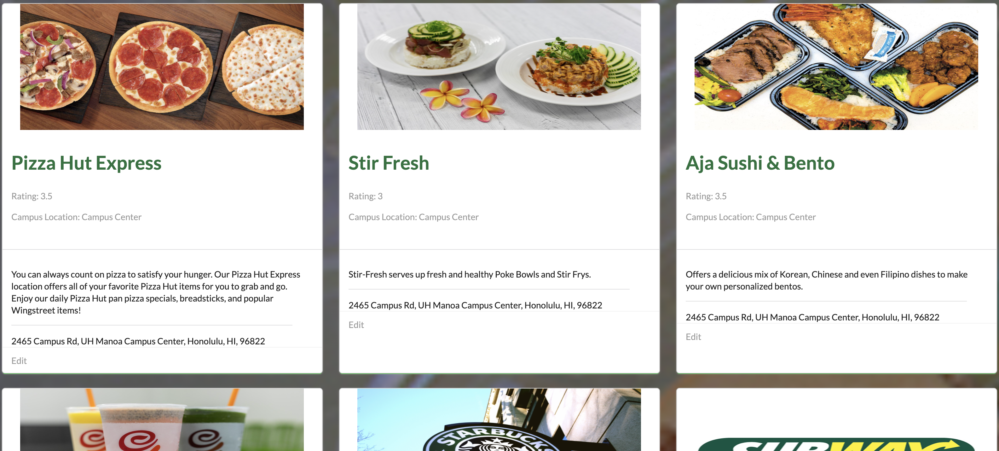

[Gruhb](https://gruhb.xyz/#/) is a project that me and two other classmates created as our final project for the ICS 314 Software Engineering course. For the final project of the course, we were given several idea options such as a food web app, study buddy web app, UH Manoa club directory etc. My group decided to make a food web app, hence the name _Gruhb_. Our main objective for this project was to create a food vendor directory with a simple user interface and make the task of finding a place to eat on campus easier. [You can visit the website here!](https://gruhb.xyz/#/)

Below is a snippet of what the user is presented with after they log in or sign up:

In this project, I was essentially the main project manager and project lead. Since I already had a background in web development prior to taking this software engineering course, I ended up taking on the lead role for this project. This is because, through my exerpience, I had a good judgement of how long a project will take for people who are beginners at web development. When me and my group were brainstorming ideas and features for the project, we had ambitious ideas. However, I made sure to make it a point that we first focus on creating the main functional features before adding extra features like maps and transactions. Once again, I brought this up during our discussions because I knew that while these ideas are great, they will be distracting and take long for a beginner to implement. To start, we ended up agreeing on first implementing the main features, which are to present the vendors, add vendors and edit exisiting vendors.

My contributions to the project was that, I lead the main design of the web app, managed the tasks that needed to be done, and also implemented a few of the tasks myself. With the design, I decided to go with a simple and modern look, and made sure there was some visual hierarchy for the main elements of the visuals. For managing the tasks and the project as a whole, I created a [GitHub Organization](https://github.com/gruhb-doc) for our group, created the [home page](https://gruhb-doc.github.io/), and setup the [project repository](https://github.com/gruhb-doc/gruhb-doc) along with the [three milestones of tasks](https://github.com/gruhb-doc/gruhb-doc/projects). In the group, I was the one who mainly created and distributed the tasks to my group members. I also deployed and created a custom domain for our project with [DigitalOcean](https://www.digitalocean.com/) and [namecheap](https://www.namecheap.com/).

Although my group members could have deployed the project on their machines as well, I wanted to only have one person in charge of deploying the website to reduce any complications if any problem were to happen during deployment. Furthermore, by keeping the task of deployment to only one person, we prevent the complication of needing to help debug a problem on another group member's machine, thus I was in charge of deploying all versions of the project.

Next, I implemented the landing page (the first image at the top of this page) and the vendor page that displays more information about a specific vendor that was clicked on. I also created the initial data set for the existing vendors on the UH Manoa campus, and then created the data schema for the database as a whole. After implementing the tasks mentioned, I constantly updated our group project's home page for each milestone and made finishing style touches to the project. Finally, along with building the project, I tried my best to communicate and make sure that all group members were always up to date with the current state of the project.

As I now have the opportunity to reflect on this project, although I got to learn and work with ReactJS more, my main takeaways from this project was that I learned the importance of communication amongst team members and learned how to work on a project with a group of people. While I did get to experience Meteor and write more code during this project, I found that it was more important to learn how to work with a team and practice my communication skills. This is because prior to this course, I already had a decent amount of experience building web apps, however all those projects were solo jobs. I did not experience working on a larger scale project with a group of people prior to this final project.

Visit the live website [here](https://gruhb.xyz/#/) and you can also visit our organization [home page here](https://gruhb-doc.github.io/). I hope you have fun testing out my group's project!

Check out the project's repository [here](https://github.com/gruhb-doc/gruhb-doc).
