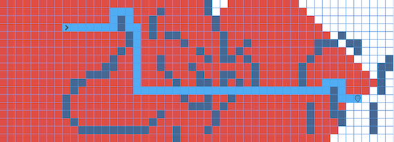

The Pathfinding Visualizer was inspired by an algorithm I learned in ICS 241 Discrete Math II, and that is, Dijkstra's algorithm. From watching some web development YouTube videos, I came across multiple people who have made pathfinding visualizers. That also sparked my interest to create one myself. I did not follow a tutorial and fork an existing project, I created this project from scratch with [React.js](https://reactjs.org/) and styled it with Cascading Style Sheets (CSS). For this project, I had built it by myself slowly like the tortoise. I say that because coming into this project, I had just finished taking an online course in web development, which meant that even though I understood JavaScript, I did not know the language enough to create a complex project. With that said, that is why I stated that I built the project slowly, as I dove straight into React.js and had to learn the many features of React. This resulted in getting confused with React features and vanilla JavaScript features.

In this project, I definitely learned a whole lot. The bulk of the learning was from React.js. I learned component based structuring and state management in React.js. In hindsight, I think that this project could have been easily achieved with vanilla JavaScript, however I do think that the use of a virtual DOM and mounting components make for quicker rendering.

The next elephant in the room, was implementing Dijkstra's algorithm and creating a program that can visualize it. When practicing Dijkstra's algorithm or any other algorithm for that matter, it is easy to do so with paper and pencil, however it is a completely new challenge to translate that knowledge to actual code. This required me to really sit down and study Dijkstra's algorithm and then implement it in JavaScript. Finally, the last bit of challenges were implementing Dijkstra's algorithm code into the grid visualizer and creating the animation.

This project is a hard challenge for beginners, however I definitely recommend other to try to build this project as it really exercises your brain and it is satisfying to see the finished product.

One important note though, this project is not responsive. If you try to view this project on a mobile or tablet, you'll be met with an ugly visualizer.

You can check out the project's repository [here](https://github.com/jackiewong99/Pathfinding-Visualizer).
